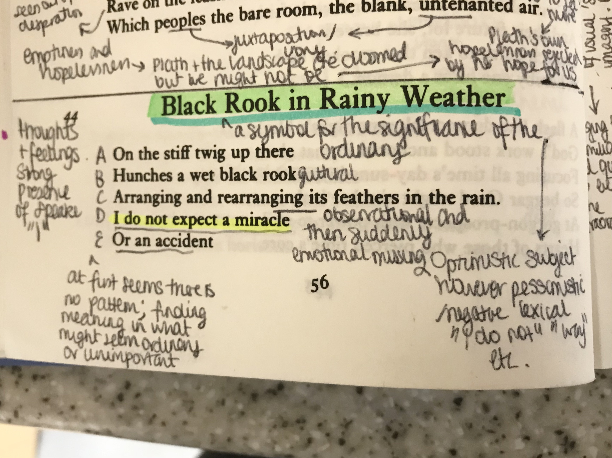
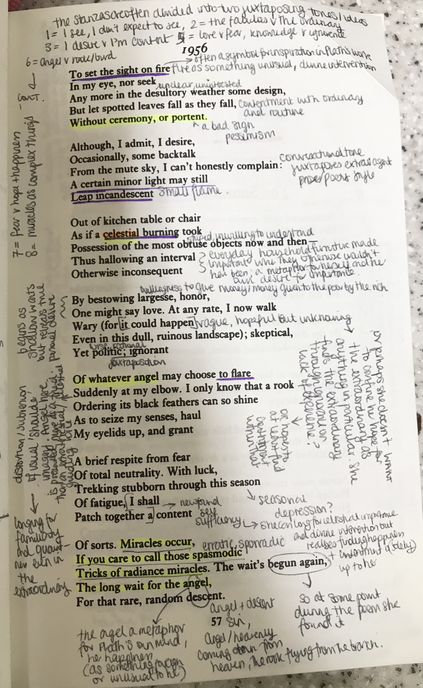

# Black Rook in Rainy Weather

This poem is one of my favourites of Plath. A beautiful optimistic exploration of finding beauty and contentment in the everyday, alongside explorations of the extraordinary and supernatural create a hopeful poem filled with binary oppositions. Plath compares and contrasts the two ideas not as she usually does with violence and negativity but with peaceful joy.

Plath's use of religious imagery here is, unlike much of her work, not disparaging or hateful but rather a genuine reflection of the human desire for greatness and to be loved. The frequent mention of "angels" in this poem creates an ethereal understone, contrasted with the thematic motif of the "rook". The juxtaposing ordinary and extraordinary could create conflict and violence however here no such violent imagery occurs. Plath hopes for the extraordinary, longing for a sense of sels-importance, for the "fire" of passion and inspiration, however equally she acknowledges the need to "patch together a content". In this way Plath's longing is no longerone of violence of self-hatred but simply a calm musing in her day-to-day life.

The rhyme scheme is, unusually for Plath, very structured as ABCDE in each stanza. Whilst at first it might seem that there is not order or rhythm, as the poem goes on it becomes more and more apparent that there is order in the chaos. This reflects the message of the poem to find meaning and importance in the everyday, in what at first might feel meaningless.

I also love the circularity of this poem, with the opening stanza exploring how Plath does not expect any "miracle" or "accident" to save her from the mundane and then the final stanza exploring the idea of these "miracles" not as the extraordinary of the celestial but as "tricks of radiance" - miracles are finding beauty in the mundane, making poetry of nature and the world around you, and finding contentment and self-worth within that world.

The poem ends on a contrastingly optimistic and pessimistic tone. Whilst the "slow random descent" might connote negativity, of her falling from grace (like the angels she mentions throughout) or an emotional and mental descent, for me this creates a sense of optimism. Plath comes to terms with the ordinarity of her world and through this comes to expect the "descent" hopefully as something extraordinary.

Something more interesting for me personally is the phrase in the penultimate line, "the wait's begun again". The use of "again" connotes that, whilst at the start of the poem she was a beginner, at some point during the events of the poem she found the "descent" - during the course of the poem Plath found the inspirationg and the meaningfulness of the everyday (perhaps through her own poetic language). In this way therefore the "descent" takes on further meaning not as something negative but as a sort of 'delving into her mind'. Just as she uses the motif of fire to connote inspiration, here again Plath explores theidea of finding meaning and therefore poetic inspiration in the everyday. She hopefully waits for it to come again just as she has finished this poem.

It is safe to say that this vulnerable, hopeful and poetically brilliant piece is the perfect finale for the 1956 section of poems. I am unashamed to say this beautiful piece reduced me to tears from the very first stanza, with the contrasting hopelessness so familiar to Plaths work combatted against for once with joy and contentment. Whilst we know as modern readers that Plath's story does not remain so free from sorrow, it is a brief and meaningful respite from the depressive and often heart-breaking poetry she is so well known for. 
