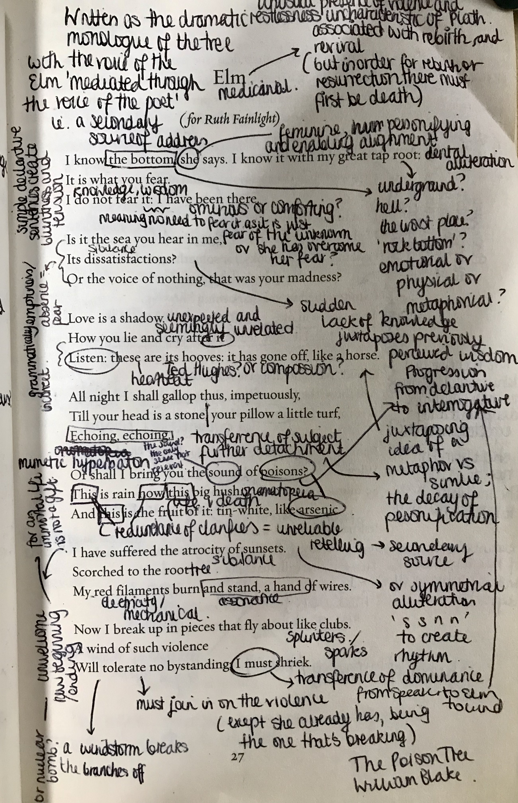
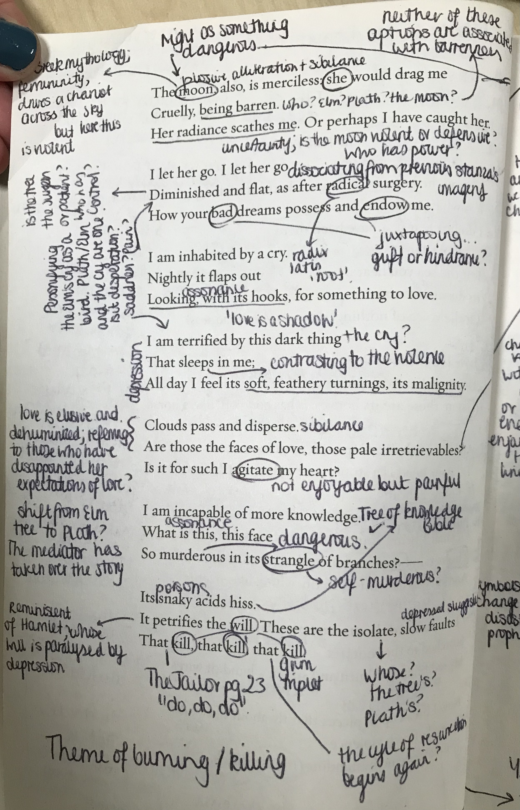

# Elm

Written as the dramatic monologue of a tree, mediated through the voice of Plath, Elm as an unusual presence of violence and restlessness. Elms themselves are associated with rebirth and revival (but in order for rebirth and resurrection there must first be death or a sacrifice). They are also associated as trees with great knowledge and wisdom, having been here on earth for centuries before humanity and the individual speaker/reader. As with much of Plath's poetry, she personifies the Elm as a woman of immense knowledge and power (which she also does with the Moon later on in the poem).

 
Throughout the poem there is a continuing battle for agency and dominance. At first Plath/the narrator is dominated by Elm and by its emotions and knowledge. The use of simple declaritive statements where the Elm dictates its knowledge and also decides what we as the reader know and feel - "It is what you fear." - conveys how the Elm has agency and power in the relationship. Both the speaker and we as readers gain knowledge from the Elm and thus become dependent on the Elm. However, the second stanza this perceived all-knowing power is revealed to be just as confused/human as we the reader and the speaker are: "Is it the sea you hear in me...?" The sudden lack of knowledge in the Elm juxtaposes her previosly perceived wisdom. Even later, the use of "I must shriek" creates a transference of dominance. The Elm is at first the most powerful in the relatinoship, hwoever quickly the storm and rain dictates the Elms actions. Finally, as the poem continues the speaker grows more nad more agency over the narrative as the lines bcomes more of Plath's and less of the Elm's. In the poem therefore it becomes imcreasingly difficult to discern a protagonist, creating a broad oscillating alignment as we try to find who in the poem has agency, who can reveal the truth to us.

There is also a cyclical sense to the poem. We begin the poem with knowing "the bottom". Could this mean hell, or death, or perhaps an emotional death? We then end the poem with the repetiton "that kill, that kill, that kill." The poem therefore begins and ends with a sense of violence and death, creating a cycle of resurrection and tragedy. Elms, as previsly mentioned, are associated with sacrifice and rebirth, therefore it is not surprising that these themes envelope the poem. However, interestingly, the Elm itself seems powerless to stop or control this death and emotional destruction. Whilst the Elm "does not fear it" like the reader is told to, it is equally "inhabited by a cry" and vulnerable to the power of nature and death.

Plath's general infatuation with death and tragedy certainly shines through in this poem. Perhaps, when viewed alongside other poems, the cylce of death and resurrection could be referring to Plath's repeated suicide attempts, or perhaps to a more general sense of tragedy and lack of control over her life and emotions. Nature is presented as a powerful controlling force over emotions and life in general in this poem; Plath here surrenders herself to the Elm, to the moon and the rain, and to violence. 
