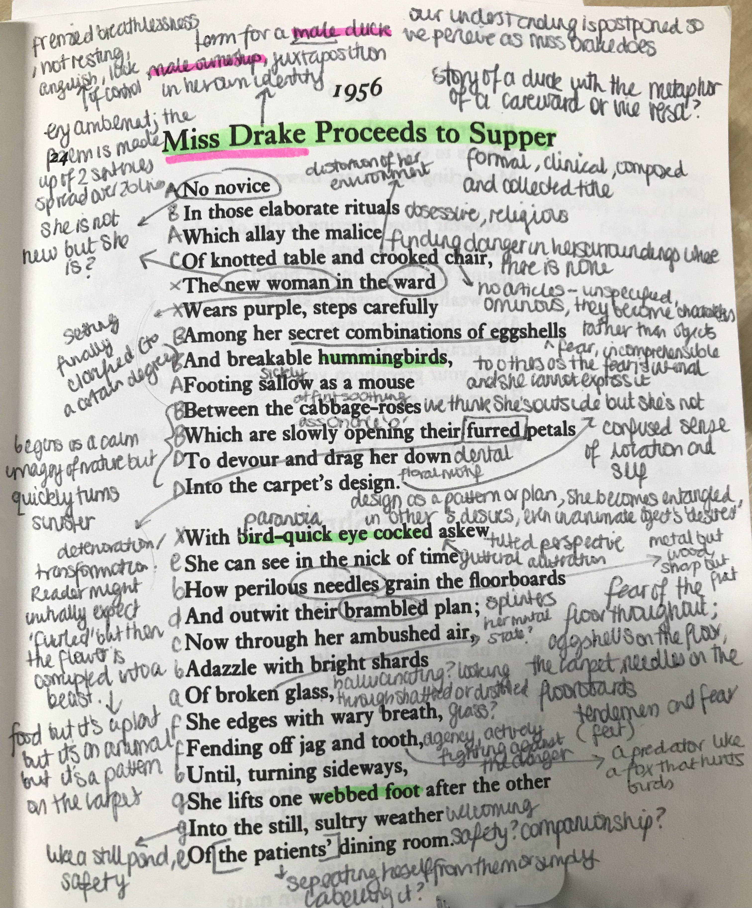

# Miss Drake Proceeds to Supper

This poem was written June 1st 1956, overlooking the River Seine. It follows the journey of Miss Drake, a patient in a careward, through what she perceives to be great danger in order to reach the safety of the "dining room".

Firstly, the title itself has many interesting aspects. First and foremost, 'Drake' is the name for a male duck, which Miss Drake is compared to in the metaphor "webbed foot" at the end of the poem. In this way, Miss Drake's identity as a woman is juxtaposed by her male identity as a duck and this confusion of identity reflects the confusion of her situation. Secondly, the title indicates a sense of formality and control, introducing the poem as if it is going to be a simple evening meal. This creates further confusion as the reader is not given what they expect. Finally, this also reflects the shame and fear of the 1950s, that Miss Drake is trying to maintain her reputation and avoid the shame of being revealed as 'insane' by putting on a facade. Plath ironically is destroying her own facade in exploring her own experiences with mental health in this very poem. 

Interestingly, the reader's understanding of the situation is frequently postponed so that we are often perceiving the events just as Miss Drake is. For instance, it isn't until the fourth line that we find out that we are in a "ward", and it isn;t until the very final line that we find out where Miss Drake is trying to get to. In this way, the environment of the pome is unfamiliar and often shifting as our understanding changes and increases, and moreover the journey feels aimless or confused until the final line. This reflects Miss Drake's internal distress and her own dissolution.

Miss Drake's hallucinations not only confuse the reader but also reflect how she has become consumed by her environment, and become institutionalised. Not only is her environment consuming her, the environment itself is increasingly unsettled, changing in nature throughout. A key example of this is the exploration of the floral carpet in the first stanza. The carpet is firstly introduced as a "cabbage", which is then immediately clarified as a metaphor for a "rose". This rose quickly however transforms into something bestial with the use of the adjective "furred". Finally, all of this is subverted by the revelation that it is simply a floral motif on a carpet. This constantly shifting description displaces the reader as they become uncertain on the location of the poem and of Miss Drake's journey itself. It also reflects how Miss Drake is finding danger everywhere she goes, and that she cannot trust her own senses anymore.

This confusion and distortion is reflected by the complex rhyming scheme. Miss Drake is attempting to make sense of her environment and protect herself against danger, however she is failing at this task because of her insanity. Similarly, the presence of a rhyme scheme creates a sense of rhythm and order however it is frequently abandoned or changing so that it becomes unreliable and a further reflection of the confusion of the situation.

Having said that she is attempting to protect herself, Miss Drake spends the vast majority of the poem fleeing or in a skittish and fearful state. It isn't until the final stanza when she is "fending off jag and tooth" that Miss Drake gains agency over her situation and takes an active role in her own story. This potentially bodes well for the character, creating a sense of optimism. Alternatively it could further emphasise her dire situation and the extremes that it is forcing her into.

All of this mental disarray however is offset by the optimistic (or at least relieving) ending. Miss Drake reaches the "still, sultry" safety of the dining room, having traversed the dangers of the corridor to get there. In this way therefore perhaps there is hope for Miss Drake, with a hopeful ending to the poem offering potential redemption from insanity. 
