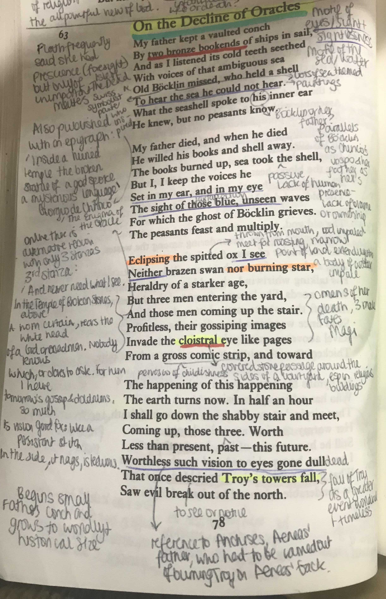
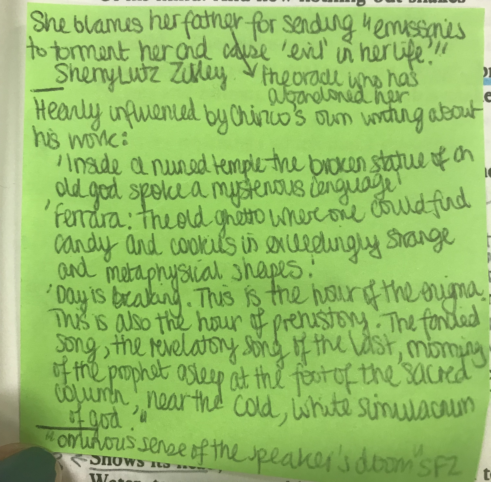

# On the Decline of Oracles #

First and foremost it is important for me to note that there are two versions of the same poem. The version I am using is from the <i> Collected Poems </i>, with four stanzas (seen in the photo below). However, there is an alternate poem with only three stanzas (written on the outisde alongside the poem photo below). Unfortunately, I have been unable to find any substantial information about the two versions of the poem, only that the version I am using is a later verson and that the first version is much more clealry inspired by Chirico's writings, as explored below.

Whilst the poem mentions the swiss symbolist painter, Böcklin, his painting 'Isle of the Dead' has very little tangible influence over the poem other than the strong presence of water and ocean imagery. Similarly, Giorgio de Chirico's painting 'The Enigma of Oracles' has very loose inspiration over the poem. In fact, the poem is more influenced by Chirico's own writings about his painting than the painting itself.

More than about art, Plath is really exploring her resentment for her father for abandoning her, with the narrative of the poem being that she believes her father has sent her ghosts or characters in order to torment her and cause "evil" in her life. However, whilst there are certainly feelings of resentment and blame, and perhaps fear of her father's deathly abilities to haunt her, the overbering feeling of the poem is one of loss - of absences. Her father is a figure from her past, the only tangible remains of him lost to someone else, and even the messages that he sends Plath are itangible. Ultimately, the "decile" that Plath is referring to, most notably in the title, is that of her own father - he is the loss of oracle in her life, he is the absence that she cannot fill or replace.

Throughout the poem one of the most interesting motifs is that of eyes, seeing, and unseeing. Perhaps a continuous reference to many historical - especially Greek and Roman - blind Oracles - and perhaps a further emphasis on absences within the poem, Plath frequently uses phrases to connote failing senses and blindness. In Stanza 2, for example, she says "Set in my ear, and in my eye/ the sigh of those blue, unseen waves". In this way, Plath presents the ocean scenery in a dual sense, as something seen, shown to her by her father, and simultaneously as something unseen. This connotes several things: firstly, it reflects the idea of ghostliness and intangibility in the poem. All remnants of her father are lost to death and to time and so she can only 'see' through her memories. Secondly, it reflects the idea of a conch conjuringt he sound of the ocean, Plath envisioning in her mind the ocean she is hearing through the conch but the ocean that is not actually present. She can envision in her mind the ocean - as she is hearing a 'false' version of it in the conch - however it isn't actually there. Similarly, this reflects the idea of Plath looking on Böcklin's painting and seeing a painted ocean. In this way, yet again, Plath is lookng upon a scen that isn't actually real. Overall this creates an atmosphere of unrealibility and absences. Nothing is as it seems in the poem, everything a falsehood or mirage, nothing tangible - especially not her dead father.

Similar to the connotations of blindness, I find the use of astrological imagery very interesting in this poem. In the third stanza, Plath describes "Eclipsing the spitted ox I see/ neither brazen swan nor burning star,". The chiasmatic use of astrological imagery in this scene creates an emphatic juxtaposition within the opening lines of this third stanza. There is an eclipse - the moon blocking out the sun and bringing about darkness - so taht she cannot see any burning star (but especially not our own sun). Often, Plath uses the sun to connote a sense of hope and joy; in taking away the sun in this poem, Plath further adds to a sense of hopelessness and absence.

Overall, the poem creates a sense of doom - inevitable even when predicted - and loss. Plath foresees her own tragedy, expecting death, loss, etc. just as her father's life ended. With his loss as an oracle, Plath herself becomes an oracle, predicting the tragedy that her father has caused through his death. 
