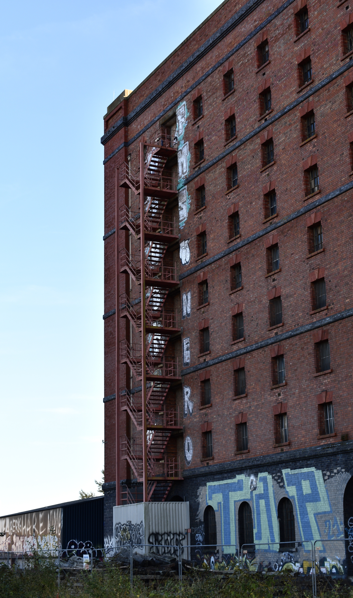
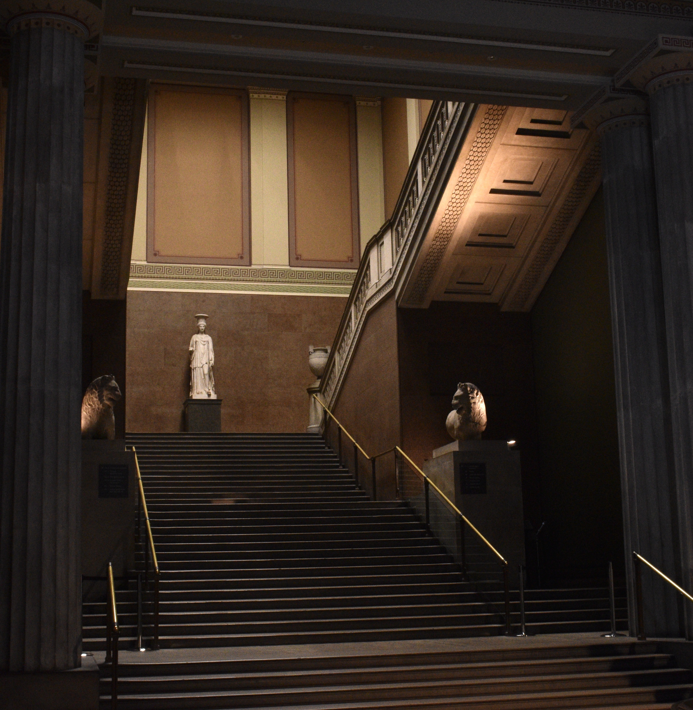

# Photography
I'm an amateur photographer and especially enjoy exploring city landscapes and the relationship between nature and modernity.

I took this photo on my way back from Ashton Court. Many of the views were amazing but I especially enjoyed editing this photo to make the colours more vibrant and reduce the glare from the sun's reflections. I like the merging of nature, society and youth culture in the scene.

I also took this photo on the same journey home from Ashton Court. I love the sharp lines of the building and the bright colours of the graffiti, and I chose to shoot with the camera portrait instead of landscape. 

Of all the photos I took on my trip to the British museum with my friend, this was one of my favourites. A companion shot to it shows the same scene with many people moving up and down the staircase - all motion blurred because of the low shutter-speed. This moment portrays the timelessness of the statues - that they have both lasted as long as they have, and that they still evoke emotions and wonder today - but also the consequential loneliness I felt when looking at her. She is both human but simultaneously other - she is like us, yet isolated. The photo itself is rather blurry, the photography skills lacking (not a surprise, seeming as I took the photo) but the image itself is wondrous. 
